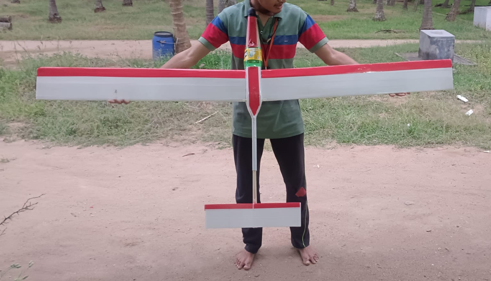

# Flight-Tested Glider

Design, fabrication, and testing of a high aspect-ratio glider optimized for glide distance and stable glide performance.

## Key Specifications
- Wingspan: 1.8 m
- Airfoil: AG35
- Launch height: 6 ft
- Glide distance achieved: 65 ft

## Engineering Contributions
- Airfoil selection and aspect ratio optimization
- CG positioning and model design
- Fabrication and flight validation

## Outcome
Demonstrated long glide distance with stable glide behavior during testing.

## Demonstration

