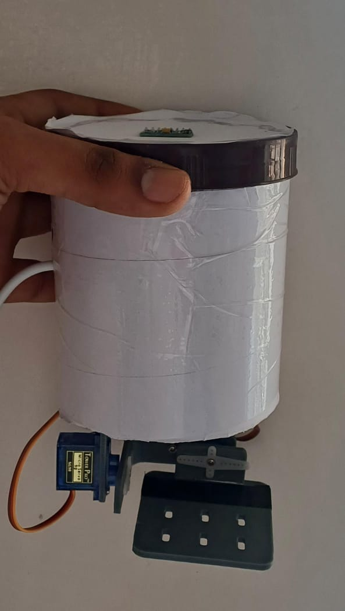

# 2-Axis PID Stabilized Gimbal Platform

Development of a pitch–roll stabilized platform using closed-loop PID control.

## Objective
To achieve disturbance rejection and stable orientation tracking.

## System Components
- Microcontroller-based controller: ESP-32
- IMU feedback: MPU6050
- Servo-driven 2-axis mechanism: SG90 servos
- MATLAB visualization interface

## Engineering Contributions
- Mechanical design using Fusion 360
- Real-time orientation monitoring
- PID tuning for stable response
  
## Outcome
Achieved stable platform behavior under induced disturbances.

## Demonstration
**Gimbal**  

**Gimbal stabilisation**  

**Matlab visualisation**  

