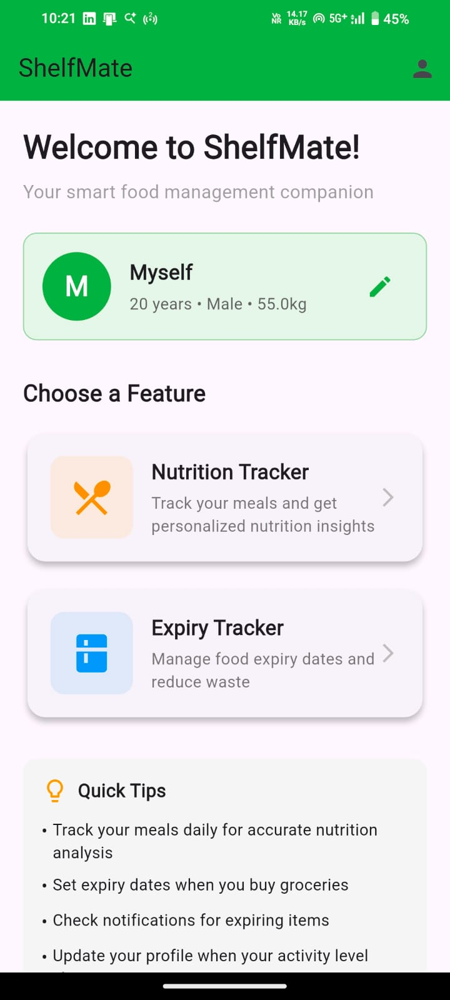
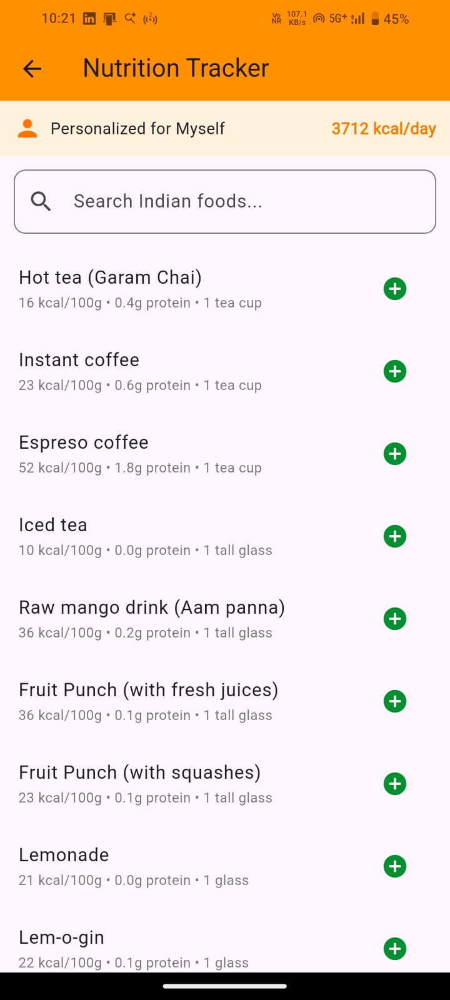
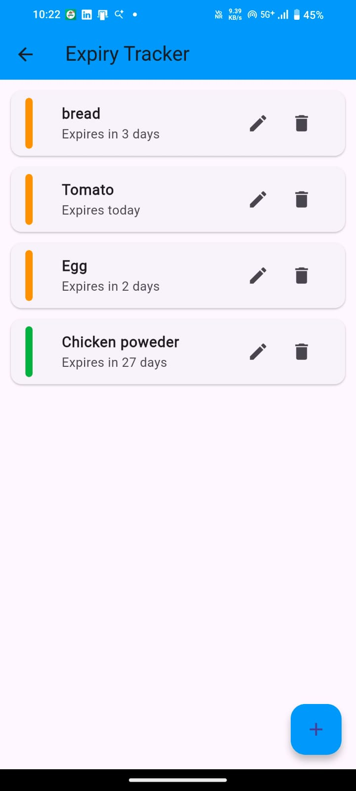

# ShelfMate – Nutrition & Expiry Tracker App

ShelfMate is a Flutter-based Android application designed to help users track nutrition intake and manage food expiry efficiently.

**Background**
- "This started as a personal-use hobby project, but I've decided to open-source it; hope someone else finds it useful!"
---

## Features

### Nutrition Analysis
- Calculates daily RDI (Recommended Dietary Intake) based on age,weight and activity level
- Analyzes dietary consumption
- Provides basic nutritional recommendations
- Tailored for Indian food database

### Expiry Tracking
- Tracks food items with expiry dates
- Automated expiry notifications
- Reduces food waste and health risks

---

## Tech Stack
Flutter • Dart • Android SDK

---

## Architecture
- Modular nutrition calculation engine
- Local data storage for food inventory
- Notification scheduling system
- Completely offline

---

## Screenshots
### Home Screen

### Nutrition Module

### Expiry Module

---

## Status
Actively maintained and open-source for educational purposes. Improvements to be made in the future.
